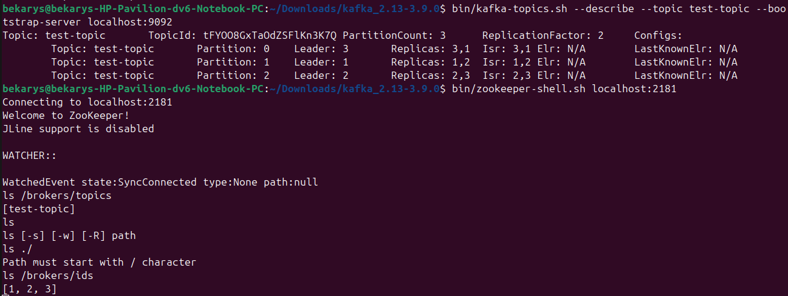

# TASK1 of kafka

Set up and configure an Apache Kafka cluster comprising three brokers named
broker01, broker02, and broker03. Ensure that the brokers start successfully and
operate together as a unified cluster.
Create topic with multiple partitions and verify the distribution of these partitions
across the brokers.

## Instructions

made a 3 brokers and 1 zookeeper to create topic and check their proper clusterization


### 1. Download Kafka and java
download kafka and unzip it
```
tar -xvzf kafka_2.13-3.9.0.tgz
cd kafka_2.13-3.9.0 // or name how you unzip it
sudo apt install openjdk-17-jdk
java -version
```

### 2. Create brokers and configure them

create 3 brokers and configure them
```bash
touch config/broker1.properties
touch config/broker2.properties
touch config/broker3.properties
```
and after that we configure each broker
```
#config/broker1.properties

broker.id=1
log.dirs=/tmp/kafka-logs-1
listeners=PLAINTEXT://localhost:9092

advertised.listeners=PLAINTEXT://localhost:9092
zookeeper.connect=localhost:2181

##################################################

#config/broker2.properties

broker.id=2
log.dirs=/tmp/kafka-logs-2
listeners=PLAINTEXT://localhost:9093

advertised.listeners=PLAINTEXT://localhost:9093
zookeeper.connect=localhost:2181


##################################################

#config/broker3.properties

broker.id=3
log.dirs=/tmp/kafka-logs-3
listeners=PLAINTEXT://localhost:9094

advertised.listeners=PLAINTEXT://localhost:9094
zookeeper.connect=localhost:2181

```
### 3. Start zookeeper
// check if zookeeper runs on 2181
```bash
bin/zookeeper-server-start.sh config/zookeeper.properties
```
### 4. Start all brokers
in different terminals run script
```bash
bin/kafka-server-start.sh config/broker1.properties //diff terminal
bin/kafka-server-start.sh config/broker2.properties //diff terminal
bin/kafka-server-start.sh config/broker3.properties //diff terminal
```
### 5. Create new topic
create with name test-topic
```bash
bin/kafka-topics.sh --create --topic test-topic --bootstrap-server localhost:9092 --partitions 3 --replication-factor 2
```
and verify it
```bash
bin/kafka-topics.sh --describe --topic test-topic --bootstrap-server localhost:9092
```
### 6. Connect to he zookeeper and verify all configs of brokers
```bash
bin/zookeeper-shell.sh localhost:2181
lc /brokers/topics
lc /brokers/ids
```

it means that brokers are configured well and runned successfully


### 7. Producer Consumer message test
make in 2 different terminals one consumer and one producer and connect to topic test-topic
```bash
bin/kafka-console-producer.sh --topic test-topic --bootstrap-server localhost:9092
```
```bash
bin/kafka-console-consumer.sh --topic test-topic --from-beginning --bootstrap-server localhost:9092
```
and send some messages


