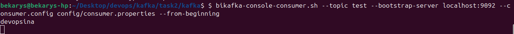
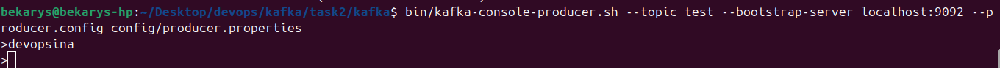

# TASK3 of kafka

Set up Kafka in Kraft mode, eliminating the need for Zookeeper. Ensure that Kafka
operates as expected by creating topics and verifying that messages can be
produced and consumed successfully.

## Instructions

### 1. Create in config/kraft/ new brokers for kraft

```bash
touch config/kraft/broker1.properties
touch config/kraft/broker1.properties
touch config/kraft/broker1.properties

```

and configure them

```properties
# broker1.properties
# kraft mode configuring
node.id=1

process.roles=broker,controller

listeners=SASL_PLAINTEXT://localhost:9092,CONTROLLER://localhost:9093
listener.security.protocol.map=SASL_PLAINTEXT:SASL_PLAINTEXT,CONTROLLER:PLAINTEXT
inter.broker.listener.name=SASL_PLAINTEXT

controller.quorum.voters=1@localhost:9093,2@localhost:9095,3@localhost:9097

controller.listener.names=CONTROLLER

log.dirs=/var/lib/kafka-logs-1

sasl.enabled.mechanisms=PLAIN
sasl.mechanism.inter.broker.protocol=PLAIN

#############################################################################

# broker2.properties
# kraft mode configuring
node.id=2

process.roles=broker,controller
         
listeners=SASL_PLAINTEXT://localhost:9094,CONTROLLER://localhost:9095
listener.security.protocol.map=SASL_PLAINTEXT:SASL_PLAINTEXT,CONTROLLER:PLAINTEXT
inter.broker.listener.name=SASL_PLAINTEXT

controller.quorum.voters=1@localhost:9093,2@localhost:9095,3@localhost:9097

controller.listener.names=CONTROLLER

log.dirs=/var/lib/kafka-logs-2

sasl.enabled.mechanisms=PLAIN
sasl.mechanism.inter.broker.protocol=PLAIN
sasl.mechanism.inter.broker.protocol=PLAIN

#############################################################################

# broker3.properties
node.id=3

process.roles=broker,controller
         
listeners=SASL_PLAINTEXT://localhost:9096,CONTROLLER://localhost:9097
listener.security.protocol.map=SASL_PLAINTEXT:SASL_PLAINTEXT,CONTROLLER:PLAINTEXT
inter.broker.listener.name=SASL_PLAINTEXT

controller.quorum.voters=1@localhost:9093,2@localhost:9095,3@localhost:9097

controller.listener.names=CONTROLLER

log.dirs=/var/lib/kafka-logs-3

sasl.enabled.mechanisms=PLAIN
sasl.mechanism.inter.broker.protocol=PLAIN

#############################################################################

```

### 2. Make clusterid for brokers with script

```bash
sudo bash cluster-id-generator.sh
```


### 3. Start brokers

in different terminals run script

```bash
bin/kafka-server-start.sh config/kraft/broker1.properties //diff terminal
bin/kafka-server-start.sh config/kraft/broker2.properties //diff terminal
bin/kafka-server-start.sh config/kraft/broker3.properties //diff terminal
```

### 5. Create new topic

create with name test-topic

```bash
bin/kafka-topics.sh   --create   --topic test   --bootstrap-server localhost:9092   --partitions 3   --replication-factor 2   --command-config config/producer.properties
```

and verify it

```bash
bin/kafka-topics.sh --describe --topic test --bootstrap-server localhost:9092 --command-config config/producer.properties
```

you can set wrong credentials for config/producer.properties and try to create and describe and see that authorization fails

### 6. Producer Consumer message test

make in 2 different terminals one consumer and one producer and connect to topic test-topic

```bash
bin/kafka-console-producer.sh --topic test --bootstrap-server localhost:9092 --producer.config config/producer.properties

```

```bash
bin/kafka-console-consumer.sh --topic test --bootstrap-server localhost:9092 --consumer.config config/consumer.properties --from-beginning
```

and send some messages




also you can change credentials in consumer.properties and producer.properties and try again
