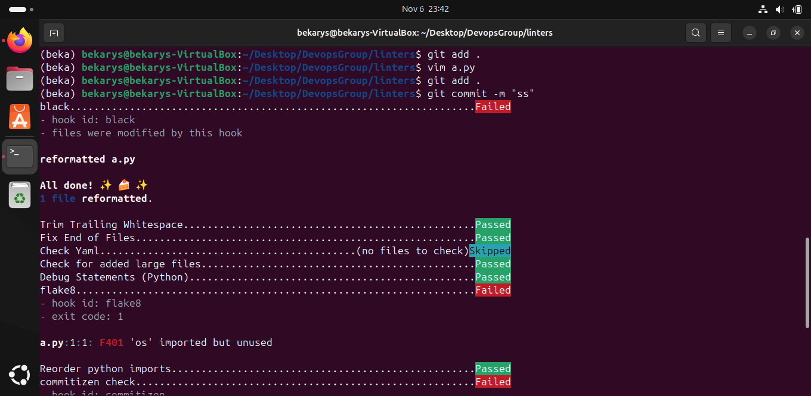
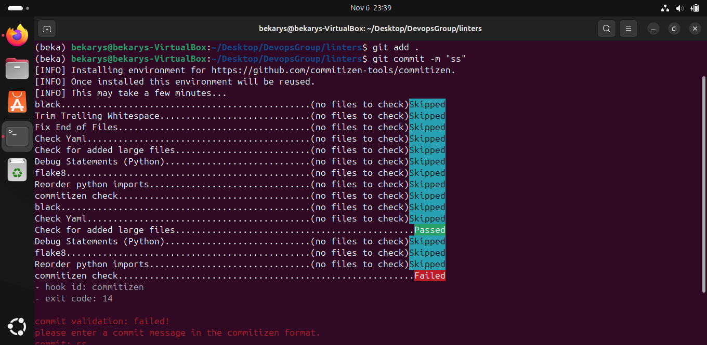
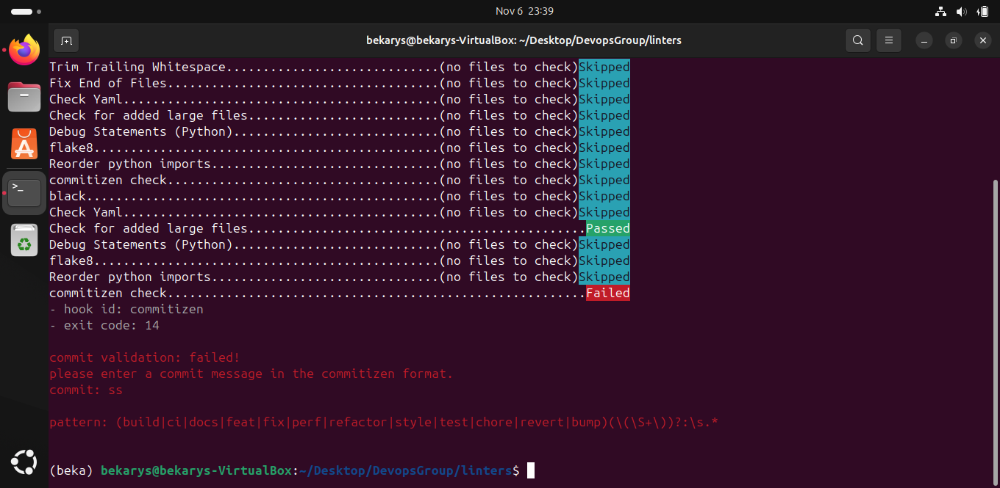
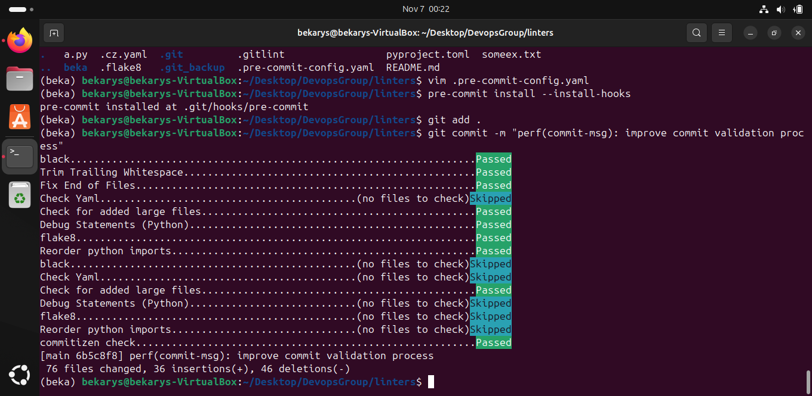

# Python Linter and Pre-Commit Hook Setup

This project uses **Flake8** to pre-commit hook to automatically run Flake8 before every commit.

## Setup Instructions

### 1. Open and activate your venv
```
python3 -m venv nameofvenv
source path/to/venv/activator
```
### 2. Install Required Tools
Second, ensure you have `pre-commit` and `flake8` installed in your virtual environment and required hooks:

```bash
pip install pre-commit flake8 commitizen
```
### 3. Install the Pre-Commit Hook

Run the following command in your project directory to activate the hooks specified in the .pre-commit-config.yaml file:

```bash
pre-commit install
```
### 4. Test the Hooks

Now, when you add and commit files, pre-commit will automatically check your code. For example make a python code with errors like unused imports and spaces and try to commit:


delete unused imports and commit but make bad commit message


make perfect commit message

