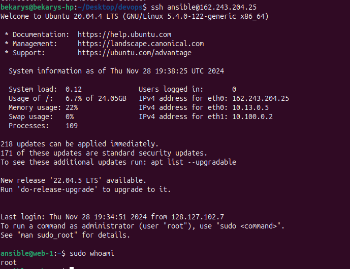

# Terraform DigitalOcean Droplet Management

This repository contains Terraform configurations to manage a DigitalOcean Droplet. It automates the provisioning of a Droplet with an ansible user and group, configured with root-equivalent sudo privileges. The setup ensures secure SSH key-based authentication and provides instructions to verify connectivity.

## Prerequisites

Before you begin, ensure you have the following installed and configured:

1. Terraform: Version 1.0.0 or later.

    Download Terraform

2. DigitalOcean Account: Sign up at DigitalOcean and obtain a Personal Access Token.

    Generate a Personal Access Token

3. SSH Key Pair: Generate an SSH key pair if you don't have one.

    ```bash
    ssh-keygen -t rsa -b 4096 -C "your_email@example.com"
    ```

    and get key

    ```bash
    cat ~/.ssh/id_rsa.pub
    ```

    This creates a public key (~/.ssh/id_rsa.pub) and a private key (~/.ssh/id_rsa).

## Project Structure

```css
terraform/
├── .gitignore
├── main.tf
├── terraform.tfvars
├── variables.tf
├── terraform.tfvars
├── versions.tf
└── README.md
```

`.gitignore`: Excludes sensitive and generated files from version control.

`main.tf`: Contains the main Terraform configuration, including provider setup, resources, and user data.

`variables.tf`: Defines the variables used in the configuration.

`terraform.tfvars`: Supplies values to the variables.

`versions.tf`: Configures terraform providers for digital ocean

`README.md`: This documentation file.

## Setup Instructions

1. Clone the Repository

   ```bash
   git clone https://github.com/dysmon/DevOps.git
   cd terraform
   ```

2. Configure Variables
   Create or update the terraform.tfvars file with your specific values:

   ```bash

    do_token = "your_digitalocean_api_token_here"

    ssh_public_key = "your ssh public key that you generated early"
   ```

3. Initialize Terraform

   ```bash
   terraform init
   ```

4. Apply the Configuration

   ```bash
   terraform apply
   ```

Confirm: Type yes to proceed.

## Verify SSH Connectivity

After successfully applying the Terraform configuration, verify that you can SSH into your Droplet using the ansible user.

1. Retrieve the Droplet's IP Address

    The Droplet's IP address is outputted by Terraform. You can also retrieve it using:

    ```bash
    terraform output droplet_output
    ```

    Example Output:

    ```bash
    droplet_output = "107.170.11.47"
    ```

2. SSH into the Droplet
   Use the ansible user that has a sudo permissions to connect via SSH.

   ```bash
   ssh ansible@output_ip
   ```

   

## Destroy the Infrastructure

To avoid incurring unnecessary charges, destroy the provisioned Droplet when it's no longer needed.

```bash
terraform destroy
```

Confirm: Type yes to proceed.
